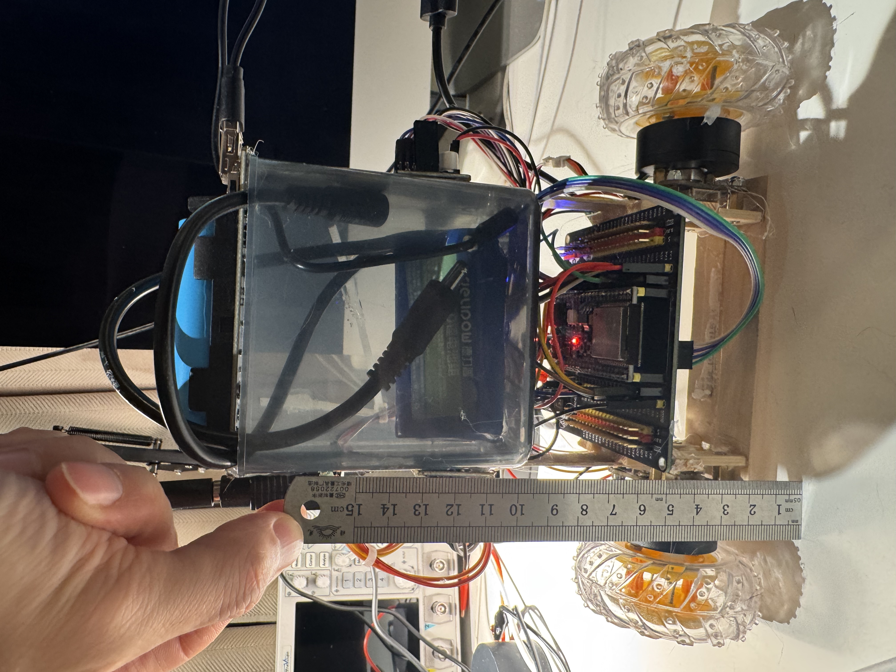

# WheelsBot - Two-Wheel Self-Balancing Robot



A two-wheel self-balancing robot built on ESP32-S3 with FOC motor control and WebSocket telemetry.

## Features

- **LQR-decomposed Cascade Control**: Parallel PID loops for angle, gyro, distance, and speed
- **CoG Self-Adaptation**: Automatic pitch offset adjustment for different payloads
- **FOC Motor Control**: Field-oriented control via SimpleFOC library
- **WebSocket Telemetry**: Real-time parameter tuning and debug visualization
- **OTA Updates**: Over-the-air firmware updates via web interface

## Hardware

| Component | Model |
|-----------|-------|
| MCU | ESP32-S3 |
| IMU | MPU6050 |
| Motor Driver | SimpleFOC Mini |
| Encoder | AS5600 magnetic encoder |
| Power | 12V DC supply |

## Software Stack

- **Framework**: Arduino + PlatformIO
- **Motor Control**: SimpleFOC
- **RTOS**: FreeRTOS
- **Web Server**: ESPAsyncWebServer
- **File System**: LittleFS

## Quick Start

```bash
# Clone repository
git clone https://github.com/yourusername/wheelsbot.git
cd wheelsbot

# Build firmware
pio run -e esp32s3

# Flash via USB
pio run -e esp32s3 -t upload

# Or flash via OTA (after first USB flash)
pio run -e esp32s3-ota -t upload
```

## Usage

1. Power on the robot
2. Connect to WiFi AP: `BalanceBot` (default password: none)
3. Open browser: `http://192.168.4.1/` for control dashboard

## Control Architecture

```
┌─────────────┐    ┌─────────────┐    ┌─────────────┐
│  Position   │───▶│  Velocity   │───▶│   Angle     │
│   Loop      │    │    Loop     │    │   Loop      │
└─────────────┘    └─────────────┘    └─────────────┘
                                             │
                                             ▼
                                      ┌─────────────┐
                                      │   Torque    │
                                      │   (FOC)     │
                                      └─────────────┘
```

## Project Structure

```
src/
├── main.cpp           # Hardware + FreeRTOS tasks + Serial commands
├── robot.h            # Data structure definitions
├── balance.cpp        # Balance control algorithm
├── imu_mpu6050.cpp    # IMU reading
├── wifi_ctrl.cpp      # WiFi/WebSocket/OTA
└── pins.h             # GPIO definitions
```

## Documentation

- [CLAUDE.md](CLAUDE.md) - Development guide and coding standards
- [docs/project_memory.md](docs/project_memory.md) - Technical decisions and constraints
- [docs/deploy.md](docs/deploy.md) - Deployment instructions

## License

MIT
